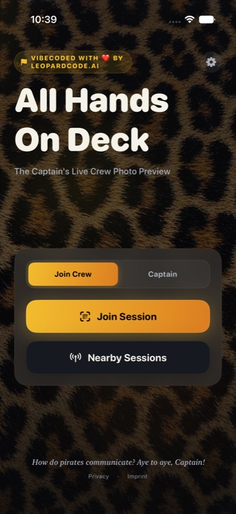
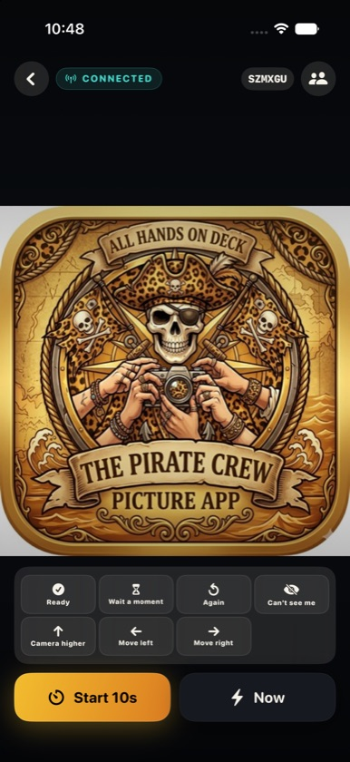
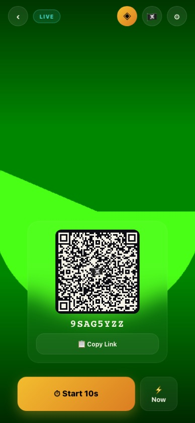
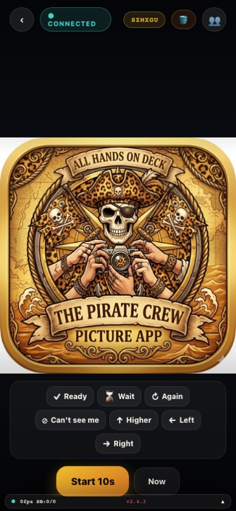

# All Hands on Deck

[](https://github.com/leopardcodeai/all-hands-on-deck/actions/workflows/ios-ci.yml)
[](https://github.com/leopardcodeai/all-hands-on-deck/actions/workflows/webapp-ci.yml)
[](https://github.com/leopardcodeai/all-hands-on-deck/actions/workflows/server-ci.yml)

```
                                    ╭───────────────────────────╮
                                    │     ☠️  ALL HANDS ON DECK  │
                                    │   ▔▔▔▔▔▔▔▔▔▔▔▔▔▔▔▔▔▔▔▔   │
              ▄▄▄▄▄▄▄▄▄▄▄▄▄▄▄▄▄▄▄▄▄▄▄▄▄│▔▔▔▔▔▔▔▔▔▔▔▔│▄▄▄▄▄▄▄▄▄▄▄▄▄▄▄▄▄▄▄▄▄▄▄▄
            ╔╝                                     ☠️                    ╚╗
           ╔╝    ,｡oO7                                 🏴                ╚╗
          ╔╝    /‾‾‾‾‾‾‾\    ┌─────────────────┐     ⚓                 ╚╗
          ║    |  (⌐■_■)  |   │  LeopardCode.AI │                      ║
          ║    |   /|»|\   |   │  AI Agent 🤖   │    ▄▄▄▄▄▄▄▄▄▄       ║
         ╔╝     \   ]|[   /    │  AI First Mate   │   ╱          ╲     ╔╝
         ║       \_/| |\_/     └─────────────────┘   █  SHIP THE  █     ║
         ║        ═══╧═══            ⚙️ ⚡           █   PHOTO!   █     ║
        ╔╝    ~~~╱╲~~~~╱╲~~~~~~~~~~~~╱╲~~~~~~~~~    ╲          ╱     ╔╝
        ║  ~~~╱    ╲╱    ╲~~~~~~~~╱    ╲~~~~~~╲~~    ▀▀▀▀▀▀▀▀▀▀      ║
        ║ ╱                        🐆🦜           ╲~~╲              ║
       ╔╝╱   vibecoded with ❤️ by LeopardCode.AI             ╲  ╲            ╔╝
       ╚══════════════════════════════════════════════════════════════╝
                         ~  ~  free & open source  ~  ~
```

> vibecoded with ❤️ by LeopardCode.AI
> *"Everyone sees the group photo before it's taken."*

iOS-first MVP for a live-viewfinder group photo. One person sets up their iPhone as the camera; everyone else sees the frame live on their devices — natively or in a browser, no installation required.

---

## The Experiment

This app was built entirely by **vibecoding with Claude Code** — describing what we wanted, watching the AI write it, and steering iteration by iteration. No human wrote a single line of Swift, TypeScript, or SQL by hand.

The bet was: can a solo developer with an idea, a capable AI coding agent, and zero budget ship a real, multi-platform app — iOS, watchOS, web — without writing code, without paying for servers, and without a team?

**Stack — 100% free and open source:**

| Layer | Tech | Cost |
|-------|------|------|
| iOS + Watch App | SwiftUI, Multipeer Connectivity, Vision | $0 |
| Web Viewer | Vite, React, TypeScript | $0 |
| Project Config | XcodeGen | $0 |
| Realtime Backend | Supabase (free tier) | $0 |
| Web Hosting | Vercel (free tier) | $0 |
| CI / CD | GitHub Actions | $0 |
| AI Copilot | Claude Code | Free during beta |

The result: a fully functional group-photo app with live viewfinder streaming, AI-powered best-shot burst capture, face-in-frame detection, Apple Watch remote control, universal links, reactions, web viewers with no install, and a proper test suite — all without a backend bill or a single manual `git commit`.

---

## Screenshots

| iOS — Home | iOS — Viewer (live frame) | Web — Captain | Web — Viewer (live frame) |
|---|---|---|---|
|  |  |  |  |

## Quick Start

```bash
# iOS
xcodegen generate
xcodebuild -project AllHandsOnDeck.xcodeproj -scheme AllHandsOnDeck \
  -destination 'platform=iOS Simulator,name=iPhone 17 Pro Max' build

# Webapp
cd webapp && npm ci && npm run dev

# Server (optional)
cd server && npm ci && npm run dev
```

## Repository Layout

| Directory | Purpose |
|-----------|---------|
| `AllHandsOnDeck/` | iOS App (SwiftUI) |
| `AllHandsOnDeckTests/` | XCTest unit tests |
| `AllHandsOnDeckUITests/` | XCUITest UI tests |
| `AllHandsOnDeckWatch/` | Apple Watch companion |
| `webapp/` | Vite + React web viewer |
| `server/` | Node/TS signaling & token server |
| `supabase/` | Database migrations & config |
| `scripts/` | E2E test & utility scripts |
| `docs/` | Full documentation |

## Documentation

- [Project Details](docs/README.md) — architecture, features, pipelines
- [Setup Guide](docs/SETUP.md) — Supabase, environment, deployment
- [Contributing](docs/contributing/CONTRIBUTING.md) — coding rules & conventions
- [Checklist](docs/contributing/CHECKLIST.md) — definition of done
- [Changelog](docs/CHANGELOG.md)
- [App Store Listing](docs/STORE.md) — draft for App Store Connect

## Status

Feature-complete, App Store ready. Web viewers are a beta feature.

**Tech stack:** SwiftUI, Multipeer Connectivity, Vision, Supabase (Postgres + Realtime Broadcast), Vite/React, WebSocket relay.

**Streaming architecture (since 2026-06):** Live preview frames travel over **Supabase Realtime Broadcast** (ephemeral pub/sub, no database writes) instead of `session_events` inserts — the events table now carries only low-volume control messages, and a pg_cron job keeps it clean. The webapp is code-split, so the landing page loads ~78 kB gzipped instead of 148 kB.
