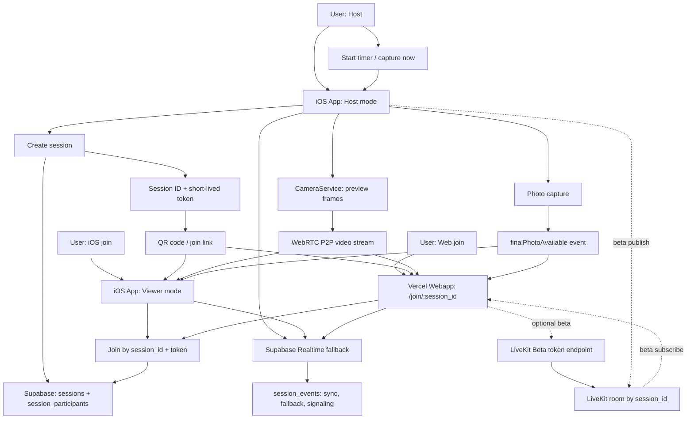

# All Hands on Deck

[](https://github.com/leopardcodeai/all-hands-on-deck/actions/workflows/ios-ci.yml)
[](https://github.com/leopardcodeai/all-hands-on-deck/actions/workflows/webapp-ci.yml)
[](https://github.com/leopardcodeai/all-hands-on-deck/actions/workflows/server-ci.yml)
[](https://github.com/leopardcodeai/all-hands-on-deck/actions/workflows/codeql.yml)

> by LeopardCode.AI
> *"Everyone sees the group photo before it's taken."*

iOS-first MVP for a live-viewfinder group photo. One person sets up their iPhone as the camera; everyone else sees the frame live on their devices — natively or in a browser, no installation required.

Runtime backend: Supabase replaces the old relay backend for database, Storage, and Realtime fallback. Setup details live in [`SETUP.md`](SETUP.md). Web Viewers are currently marked and treated as a **Beta** feature: Supabase is the session backend, while live video remains WebRTC/P2P-first and is never stored in Supabase.

---

## Status

- ✅ **Step 1**: SwiftUI skeleton, mock transport, host and viewer flow.
- ✅ **Step 2**: Multipeer Connectivity, QR scanner, real frame streaming, nearby discovery.
- ✅ **Step 3**: Node/TS signaling server, Vite web app viewer, iOS WebSocket transport, composite transport (Multipeer + Web in parallel).
- ✅ **Step 4**: Vision-based "Am I in the picture?" hints (face detection, tilt/crop recognition).
- ✅ **Step 5**: Best-Shot burst capture with AI ranking (faces, open eyes, sharpness).
- ✅ **Step 6**: Apple Watch Companion (WCSession bridge, live countdown on wrist, trigger/cancel/now).
- ✅ **Step 7**: Universal Links + custom URL scheme (`allhands://`), server serves AASA.
- ✅ **Step 8**: Reactions ("Ready", "Camera higher", "Further left" etc.) — on iOS viewer and web viewer, host gets toast + watch snapshot.
- ✅ **Step 9**: XCTest suite for deterministic building blocks (CountdownCoordinator, URL parser, wire format, ID generator, mock broker, image compression).
- ✅ **Step 10**: PrivacyInfo.xcprivacy manifest, session TTL expiry enforcement (host-side timer triggers `.sessionEnded` automatically).
- ✅ **Step 11**: XcodeGen `project.yml` → `AllHandsOnDeck.xcodeproj` (iOS + Watch + Tests), entitlements, app icon scaffold.
- ✅ **Step 12**: Localization (de + en) — `Localizable.strings` for iOS and Watch; all UI strings and model properties localized.
- ✅ **Step 13**: Fly.io deployment — `Dockerfile` (multi-stage) + `fly.toml`; webapp build bug (`vite/client` types) fixed.
- ✅ **Step 14**: App Store Draft (`STORE.md`) — description, keywords, privacy nutrition label.
- ✅ **Step 15**: Automated happy-path tests (121 tests: XCTest 76 + XCUITest 15 + Webapp 18 + Playwright 11 + Python E2E)
- ✅ **Step 16**: UI fixes — notch spacing host view, bottom buttons more compact (viewer-style), DesignLabels centralization
- ✅ **Step 17**: Supabase session backend + Web Viewers **Beta** policy controls (10 min sessions, 3 P2P viewers, short-lived QR token, TURN hard limit, no Supabase video storage).
- ⏭ **Deferred (post-MVP)**: persistent gallery / event mode, smile detection, SFU for larger viewer groups.

**Everything done — App Store ready.**

### Still outstanding (needs your data)

| What | Where to replace |
|---|---|
| Apple Team ID | `project.yml` → `TEAMID`, `server/public/.well-known/apple-app-site-association` |
| Vercel Webapp URL | `WEB_JOIN_BASE_URL` / iOS `joinBaseURL` |
| Real domain | `project.yml` entitlements, AASA, Vercel domain |
| App icon (1024×1024 PNG) | `AllHandsOnDeck/Resources/Assets.xcassets/AppIcon.appiconset/` |

```bash
# Build project
xcodegen generate   # after every change to project.yml

# Deploy webapp
# GitHub → Vercel builds webapp/ via vercel.json.
# Manual: vercel --prod
```

---

## Repository Layout

```
AllHandsOnDeck/        iOS App (SwiftUI)
AllHandsOnDeckWatch/   Apple Watch Companion App (Step 6)
AllHandsOnDeckTests/   XCTest unit tests (Step 9)
server/                Optional Node/TS WebSocket signaling/relay + AASA
webapp/                Vite + React web viewer (PWA-capable)
```

---

## Running everything locally

You'll need:
- Node 20+
- Xcode 16+
- 2 real iPhones (for Multipeer test) **or** 1 iPhone + browser (for web viewer test)
- All devices on the same Wi-Fi

### 1. Start backend

```bash
cd server
npm install
npm run dev
```

→ runs on `:8787`. Health check: `curl http://localhost:8787/health`.

### 2. Start web app

```bash
cd webapp
npm install
npm run dev
```

→ runs on `http://localhost:5173`. Vite is bound to `0.0.0.0`, so you can reach it from your iPhone via `http://<your-mac-lan-ip>:5173`.

Override server URL: `VITE_SERVER_URL=ws://192.168.1.10:8787 npm run dev`.

### 3. iOS App Configuration (UserDefaults)

Set via Xcode scheme or `Settings.bundle`:

| Key | Value | Purpose |
| --- | --- | --- |
| `webSocketServerURL` | `ws://192.168.1.10:8787` | Where the iOS host connects when "Allow Web Viewers" is enabled |
| `joinBaseURL` | `http://192.168.1.10:5173` | What the QR code in the host panel links to |

Fastest way: Xcode → Edit Scheme → Run → Arguments. Environment Variables are not compatible with `UserDefaults`. Use **Launch Arguments** instead:

```
-webSocketServerURL ws://192.168.1.10:8787
-joinBaseURL http://192.168.1.10:5173
```

(Xcode maps these as `UserDefaults` default values for the session.)

### 4. Host session with web viewer (Beta)

Web Viewers are a **Beta** feature in the app UI and policy. Use them for MVP testing; native nearby viewers remain the default path.

1. iPhone A → enable "Allow Web Viewers" with **BETA** badge → "Start Group Photo".
2. QR panel shows a code pointing to `http://<mac>:5173/join/<sessionId>`.
3. iPhone B Safari or Mac browser → scan QR / open URL.
4. Web app connects to backend WebSocket → receives `sessionMetadata`, then live frames.
5. Host starts 10s timer → both clients (Multipeer native + Web) see synchronized countdown.
6. Photo capture → web viewer shows final photo + "Save" button.

### Happy Path Flow



---

## Step 4 — "Am I in the picture?" Vision Hints

- Runs on the same 3 fps preview pipeline, no extra tap on AVCaptureSession.
- `VNDetectFaceRectanglesRequest` → Bounding Boxes → Verdict:
  - `noFaces` / `allInside` / `someClipped`
  - Center-of-mass skew: `skewedLeft`, `skewedRight`, `tooHigh`, `tooLow`
- Shows as a chip above the capture button. When "everyone's in" it turns green (Theme.signal), otherwise gold.
- Throttle 0.5s, runs on its own `DispatchQueue` so main stays at 60 fps.

Architecture slot for later: `InFrameDetector` is designed as `ObservableObject`, you can broadcast verdicts over the transport protocol to viewers ("You're cut off on the left").

## Step 5 — Best-Shot Burst

- Settings sheet → "Best-Shot Burst" toggle.
- During active burst capture, `CameraService.captureBurst` takes 5 photos with ~0.35s gap.
- `PhotoQualityScorer` distributes async tasks per photo:
  - Face Count via `VNDetectFaceLandmarksRequest`
  - Eyes-Open Score via eye landmark bounding box aspect ratio
  - Sharpness via Variance-of-Laplacian (CIConvolution3x3 + CIAreaAverage)
  - Composite with weighted sum
- `BurstPickerView` shows all candidates, the AI top-1 with ⭐ badge.
- Captain picks → `acceptBurstPick` rebroadcasts as `finalPhotoAvailable`.

---

## Build and Troubleshooting Checklist

| Symptom | Cause → Fix |
| --- | --- |
| App crashes on "Start Group Photo" | `NSCameraUsageDescription` missing → Info.plist |
| Local network prompt doesn't appear | `NSLocalNetworkUsageDescription` + `NSBonjourServices` missing → Info.plist + **delete app from device and reinstall** |
| Nearby finds nothing | Service type mismatch between `MultipeerSessionTransport.serviceType` and Bonjour entry |
| Web viewer shows "connecting" with no progress | Backend unreachable / wrong `webSocketServerURL` → check `curl http://<mac>:8787/health` from iOS browser |
| Web viewer connected but no frame | Host hasn't enabled Web Join Beta → toggle on Home → re-enter host session |
| QR code opens `https://allhands.leopardcode.ai/...` and 404 | `joinBaseURL` UserDefaults not overridden |
| Vision hints flicker in dark rooms | Increase throttle in `InFrameDetector.minInterval` (default 0.5s) |
| Burst picker empty despite triggering | `captureBurst` failed after photo 1 → AVCapturePhotoOutput won't allow captures while `isAvailable == false`. Check Xcode console for Camera errors |
| Multipeer finds peer slowly | Devices not on same Wi-Fi (guest Wi-Fi, captive portal) |
| More than 3 web viewers trying to join | MVP policy limits WebRTC/P2P to 3 viewers per host; larger groups need SFU later |

---

## Architecture — Transport Layer

```
SessionTransport (protocol)
├── MockSessionTransport            in-process broker
├── MultipeerSessionTransport       MCSession + Bonjour
├── WebSocketSessionTransport       URLSessionWebSocketTask → Node relay
└── CompositeSessionTransport       fan-out across multiple children
                                     (Host uses it for Multipeer + Web)
```

`SessionWireMessage` is the Codable envelope and identical across all transports. The web client uses a TS mirror (`webapp/src/wire.ts`).

```
Frame Pipeline:
  AVCaptureVideoDataOutput
    → CameraService.captureOutput (off-main)
      → CIContext (single instance, hoisted)
        → JPEG q=0.5, 640px wide, ~3 fps
          → previewFrameConsumer (@Sendable closure)
            → HostSessionViewModel.broadcastPreviewFrame
              ├── InFrameDetector.ingest (vision)
              └── transport.send(.previewFrame)
                  ├── Multipeer (.unreliable)
                  └── WebSocket (JSON, base64)
```

```
Capture Pipeline:
  CountdownCoordinator (target Date)
    → CameraService.capturePhoto / captureBurst
      ├── single → ImageCompression (1280px, q=0.7) → broadcast
      └── burst (5×, 0.35s gap) → PhotoQualityScorer.rank
                                    → BurstPickerView (UI)
                                      → acceptBurstPick → broadcast
```

---

## Step 6 — Apple Watch Companion

The Watch app is a separate Xcode target — Apple doesn't let you do that via file drop alone. Guide at [`AllHandsOnDeckWatch/README.md`](../AllHandsOnDeckWatch/README.md).

Quick version:
1. Xcode → File → New → Target → watchOS → App.
2. Delete stub files, drag all files from `AllHandsOnDeckWatch/` in.
3. **Important**: Add `AllHandsOnDeck/Services/Watch/WatchProtocol.swift` to both targets (Target Membership in the File Inspector).
4. Build Watch scheme.

What it can do:
- Auto-connect via WCSession on app start.
- Live snapshot from iPhone: captain name, crew count, timer duration.
- Trigger buttons: "Timer 10s", "Now", "Cancel during countdown".
- Synchronized countdown counter via `TimelineView` against `photoAtEpochMs`.
- Latest reaction display ("Ready", "Camera higher" etc.).

## Step 7 — Universal Links

iOS Setup:
1. Xcode → Target → Signing & Capabilities → **+ Associated Domains**.
2. Add domain: `applinks:allhands.leopardcode.ai` (replace with your domain).
3. App URL scheme `allhands://` is already configured in Info.plist.

Server Setup:
1. Adjust `server/public/.well-known/apple-app-site-association`:
   - Replace `TEAMID` with your Apple Team ID
   - Replace bundle ID with yours
2. Deploy webapp to Vercel; run optional token/relay server on Supabase Edge Functions, Cloud Run, Fly.io, Railway, or DigitalOcean.
3. HTTPS required for Apple — most platforms deliver this automatically.
4. Validation: `curl https://your-domain/.well-known/apple-app-site-association` must return `application/json`.

Code path:
```
Universal Link → onContinueUserActivity (NSUserActivityTypeBrowsingWeb)
                  → UniversalLinkHandler.handle(url:)
                    → SessionURLParser.sessionID(from:)
                      → HomeView pendingSessionID → ViewerSessionView push
```

Custom scheme `allhands://join?session=ABC` works identically via `onOpenURL` and is a fallback for devices without installed app redirection.

## Step 8 — Reactions

- Viewer (iOS and Web): taps chip from 7-reaction strip.
- Wire: `SessionEvent.reactionSent(by, reaction)` with `Reaction.rawValue`.
- Host: toast at top of capture view for 2.5s, watch snapshot updated.
- Framing hints (camera higher, left, right, "can't see myself") trigger `Haptics.warning()`, normal reactions only `Haptics.tick()`.

## Step 9 — Tests

Setup guide in [`AllHandsOnDeckTests/README.md`](../AllHandsOnDeckTests/README.md). Quick: Xcode → File → New → Target → Unit Testing Bundle → drag all files in → ⌘U.

Coverage:
- `CountdownCoordinatorTests` — state machine + target date math
- `SessionURLParserTests` — all three URL formats + garbage input
- `SessionWireMessageTests` — Codable round-trip including large frame blob
- `PhotoSessionTests` — ID alphabet, uniqueness, joinURL override
- `NearbySessionSummaryTests` — discovery info decoding
- `MockSessionTransportTests` — broker isolation, no self-echo
- `ImageCompressionTests` — downscale + garbage passthrough

Webapp + Server side:
- `webapp/` — Vitest. `applyEvent` reducer (all wire events), `pirateRank` persistence, wire format golden tests against iOS-conformant envelopes.
- `server/` — `node:test` via `tsx`. `RoomRegistry` routing rules (host → all viewers, viewer → host only), closed socket skip, GC, join param validation.

What's not covered (AVFoundation, Multipeer, WebSocket, Vision) are integration paths that need hardware or live servers — run through manually via the test plans above.

### CI / GitHub / Vercel

GitHub Actions workflows in `.github/workflows/`:
- `ios-ci.yml` — `xcodegen generate` + `xcodebuild test` on macOS-14.
- `webapp-ci.yml` — `npm ci` → `tsc -b` → `vitest run` → `vite build`.
- `server-ci.yml` — `npm ci` → `tsc --noEmit` → `node:test` → `tsc` → `docker buildx` smoke-build of the production image.
- `vercel-webapp.yml` — Preview deploys for pull requests and production deploys on push to `main`, when `ENABLE_VERCEL_DEPLOY=true` is set.

Each workflow only runs when its associated path has changed (see `paths:` filter), so a web PR doesn't trigger a 15-minute iOS build queue. CodeQL additionally runs on every push and weekly.

Vercel is the webapp host. The root configuration `vercel.json` builds the Vite app from `webapp/` and serves `webapp/dist` with SPA rewrites.

GitHub Secrets for Vercel:

```text
VERCEL_TOKEN
VERCEL_ORG_ID
VERCEL_PROJECT_ID
VITE_SUPABASE_ANON_KEY
```

GitHub Variables:

```text
ENABLE_VERCEL_DEPLOY=true
VITE_SUPABASE_URL
VITE_ENABLE_LIVEKIT_BETA
VITE_LIVEKIT_TOKEN_ENDPOINT
```

Note: `ENABLE_VERCEL_DEPLOY` stays `false` until the GitHub Login Connection is set in Vercel and a `VERCEL_TOKEN` is stored as a GitHub Secret. Manual CLI deploys work independently.

Run everything locally at once:

```bash
( cd webapp && npm ci && npm run typecheck && npm test && npm run build )
( cd server && npm ci && npm run typecheck && npm test && npm run build )
xcodegen generate && xcodebuild test \
  -project AllHandsOnDeck.xcodeproj -scheme AllHandsOnDeck \
  -destination 'platform=iOS Simulator,name=iPhone 15,OS=latest'
```

## Step 10 — App Store Readiness

**Privacy Manifest** (`AllHandsOnDeck/Resources/PrivacyInfo.xcprivacy`):
- `NSPrivacyTracking` = false
- No tracking domains
- No data collection
- Declares `NSPrivacyAccessedAPICategoryUserDefaults` with Reason `CA92.1`
- Drag-and-drop into Xcode project, Target Membership iOS App.

**Session Expiry Enforcement**:
- HostSessionViewModel starts a task against `session.expiresAt`.
- On expiry: `transport.send(.sessionEnded)` to all peers, local alert, pop to Home.
- Default TTL is 10 minutes (`PhotoSession.init(ttlMinutes:)` default).
- Privacy guarantee: ephemeral, no accounts, no lingering rooms.

**Privacy Position for Store Listing** (for reference):
- Data collected: NONE.
- Data shared: NONE.
- Tracking: No.
- Account creation: No.
- Photo storage: only locally in the photo library after explicit "Save" tap.
- Session data: ephemeral in the Multipeer mesh or in relay server RAM. After 10 min idle GC, no persistence layer.

## What's deliberately left out

- **WebRTC**: WebSocket relay handles 3 fps preview just fine. WebRTC would only be worthwhile at 30 fps or bidirectional audio.
- **Persistent photo gallery / event mode**: no backend state, no accounts. Sessions are ephemeral, TTL 30 min, then GC.
- **Smile detection**: Vision has no direct smile score on iOS (CoreImage has a weak `CIDetectorSmile`, not worth it). Extensible via CoreML later.

---

## Directory Tree

```
AllHandsOnDeck/
  App/
  Models/
  Services/
    Camera/
    Countdown/
    Nearby/
    QR/
    Session/
      MockSessionTransport.swift
      MultipeerSessionTransport.swift
      WebSocketSessionTransport.swift
      CompositeSessionTransport.swift
      SessionWireMessage.swift
      SessionManager.swift
      SessionTransport.swift
    Vision/
      InFrameDetector.swift
      PhotoQualityScorer.swift
  ViewModels/
  Views/
    Components/
    Host/
      HostSessionView.swift
      BurstPickerView.swift
      ...
    Nearby/
    Viewer/
  Utilities/
  Resources/

server/
  src/index.ts        WebSocket relay
  package.json

webapp/
  src/
    main.tsx
    HomePage.tsx
    JoinPage.tsx
    SessionClient.ts
    wire.ts
    styles.css
  index.html
```
