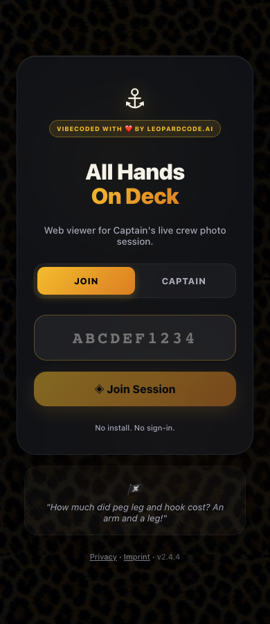
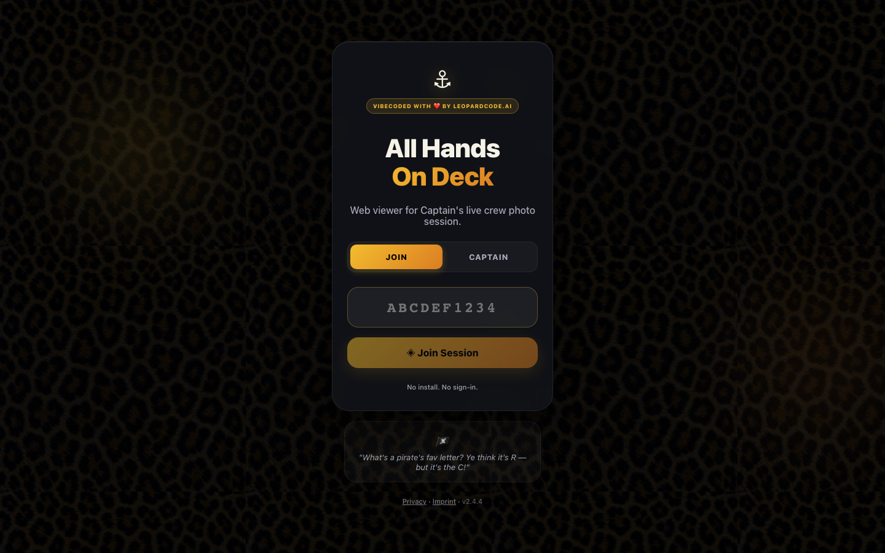
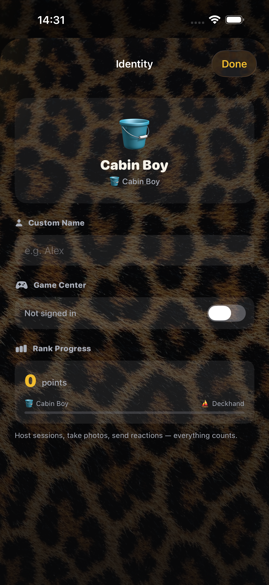

# App audit — GitHub #122

## Changes

- Landing: parse full invitations without truncation or token case changes, reject malformed codes, fix legal links, centralize copy, expose loading/focus/pressed states, honor reduced motion.
- Web hosting: apply preview size/quality controls, stop camera tracks on navigation and startup failure, discard late session creation, make countdown cancellation prevent capture.
- Browser capture policy: advertise `hostOnly` and explain captain-controlled capture. The previous permission buttons did not implement viewer-triggered capture; they have been removed. iOS capture permissions are unchanged.
- iOS identity settings: centralized localized labels, named accessible controls, Done keyboard action, service-owned persistence read, spacing tokens.
- Dependencies: compatible lockfile updates in webapp/server; zero npm audit findings. Already-merged upstream TypeScript/jsdom major upgrades retained. No external Swift packages are configured in project.yml.
- Version: 2.4.4 on web home/join and iOS marketing version. DebugOverlayView.swift no longer exists.
- SwiftLint: fixed six existing findings and moved the analyzer-only rule to analyzer_rules.

## Validation

- Web: 59 unit tests; production build; npm audit.
- Browser: mobile 320/390px and desktop 1440px layouts, reduced motion, invite input, legal links, host/join flows; 25 passed, one environment-specific no-backend fallback skipped when backend is configured.
- Server: 10 tests, build, npm audit.
- iOS: 83 unit tests; three UI tests (identity accessibility, host settings sheet, back navigation) on iPhone 17 Pro Max / iOS 26.5. Unit suite also passed on iOS 27 before final lint cleanup.
- SwiftLint strict: zero violations.
- Independent code review: no critical/important findings after lifecycle fixes.

## Screenshots

## Limits

Physical multi-device camera/Watch testing and App Store publishing are not covered by this audit. Browser-hosted viewer-triggered capture remains unsupported and is now presented accurately. Preview bandwidth varies with the selected quality and frame size; no production latency benchmark was performed.

Linear workspace unavailable; the user explicitly authorized GitHub-only tracking for this work.
